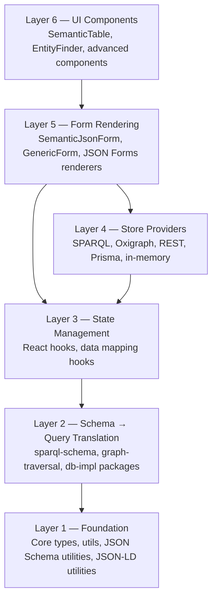
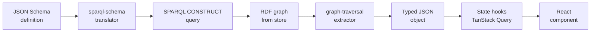

# Architecture and data flow

The framework is organized into six layers, each consuming only from layers below it:

Layers 1 and 2 are the **server-safe core**: no frontend dependencies, consumed by both browser applications and command-line tooling. Layers 3 and 4 introduce React and storage-specific code. Layers 5 and 6 are the user-facing surfaces.

The data flow for a typical read operation:

Writes follow the inverse pipeline: form data is validated against the schema, transformed into RDF triples (or the equivalent for non-RDF stores), and committed via INSERT/DELETE operations.

---

## See also

- [Capabilities today](capabilities-today.md) — what each layer provides in product terms.
- [Deployment scenarios](deployment-scenarios.md) — which layers matter in which deployments.
- [Glossary](glossary.md) — [Browser/server symmetry](glossary.md#62-browserserver-symmetry), [AbstractDatastore](glossary.md#66-abstractdatastore).
