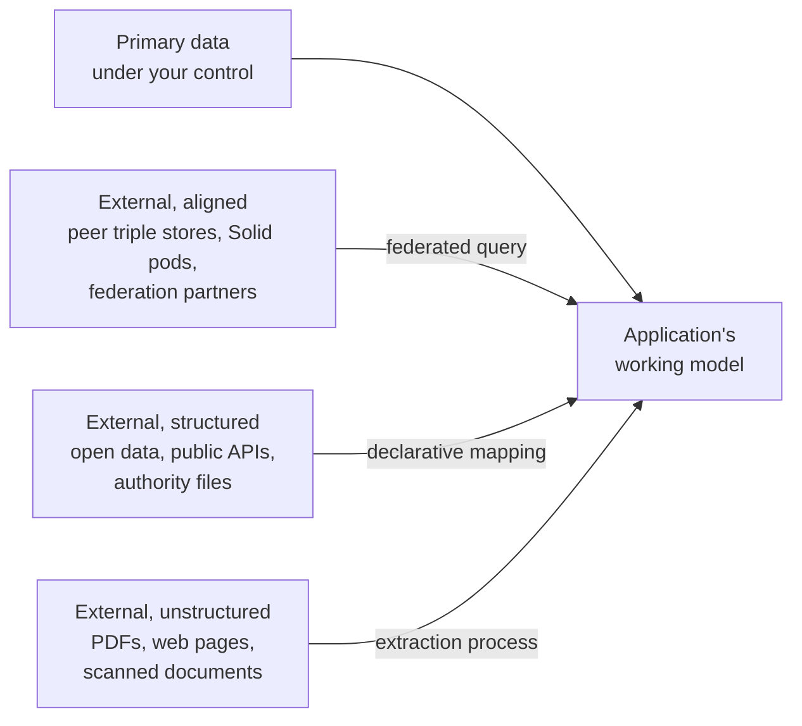
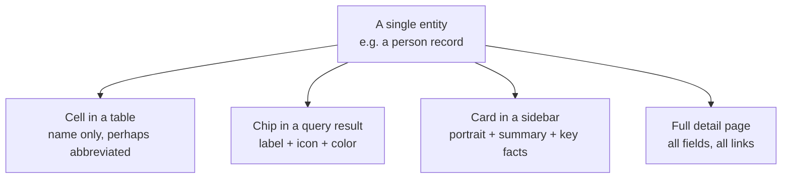

# The shape of a federated application

*A reader's primer to the problems Graviola addresses.*

---

## 1. Where the difficulty begins

Most software is built on a comfortable assumption: there is one database, the application owns it, the schema is what the team decided, and every record is under the same roof. Frameworks, tooling, and conventional wisdom all rest on this picture. It works well for a great many systems and should not be abandoned where it suffices.

Some applications, however, cannot live inside that picture. A cataloging system needs to reference biographies that are maintained by a national library. A research tool needs to align its records with public datasets that change on their own schedule. A personal information system needs to make sense of files, messages, and bookmarks that arrived from many different programs over many years. In each of these cases, the application has data of its own — but it is surrounded by, and dependent on, data it did not produce.

This document is a guided tour of that surrounding landscape, written for readers who have not yet built systems at this shape. It introduces the conceptual terrain in two halves: the **data side** (where information comes from) and the **representation side** (how that information is given visible form). Both halves shape Graviola's design.

---

## 2. The data landscape

It is common to speak of data sources in terms of ownership — *your* data versus *theirs* — but ownership is a coarse instrument. The more useful question is how much interpretive work is required to bring data into your application's working model. The landscape can be sketched in roughly four bands.

**Primary data** is the application's own. Its schema is decided by the team that builds the application; its migrations are run on the team's terms; its reliability is the team's responsibility. This is the comfortable case.

**External, aligned** data is held by others but already speaks a vocabulary the application can understand. Another organization's triple store, a federation partner's Solid pod, a peer running the same software at a different site — in each case the data arrives in a form that requires identification but not interpretation. The work is to query it, to merge it, and to keep track of provenance.

**External, structured-but-unaligned** data is the largest band by volume. It is well-formed — public datasets, authority files such as Wikidata or the German Integrated Authority File, REST APIs returning JSON — but it speaks someone else's vocabulary. To enter the application's working model, it must be transformed: a *birthDate* in one schema becomes a *dateOfBirth* in another; a flat string is split into structured components; a nested array is flattened or restructured. This is the territory of declarative mapping.

**External, unstructured** data carries information with no schema at all: PDFs, scanned documents, web pages, audio transcripts, photographs of receipts, and so on. In order to become usable, this data must undergo a structuring process—whether that's a hand-written extractor, a rule-based pipeline, supervised machine learning, or (increasingly) a large language model. The goal of such processes is to output structured data, which then enters the same declarative mapping funnel as the structured-but-unaligned data described earlier.

It's important to note that the boundaries between these bands are rarely clear-cut. A federated peer's data may be perfectly aligned in some areas and completely foreign in others; a language model extractor may yield structured output along with confidence scores or provenance metadata requiring further interpretation. The key takeaway is not to obsessively classify, but rather to understand the *distance* and *transformation work* required to integrate any given data source into your application's model.

This layered view has deep parallels with Tim Berners-Lee's [5-star deployment scheme for Linked Open Data](https://5stardata.info/en/), which describes a progression from raw data on the web, to structured formats, to standardized schemas, to linked data, and finally to full interlinking with external sources. But this is not a concern only for "open data" or public datasets: every application—whether its sources are open, closed, or internal—faces this gradient of alignment, structuring, and integration. The five-star model offers a lens for thinking about *all* data sources and the varying levels of effort required to bring them "home" into your application's ecosystem.

---

## 3. From having data to showing data

Once information has reached the application's working model, a second question opens. People do not consume models; they consume views of models. The same record will be encountered in a list of search results, a row in a table, a card in a sidebar, an entry on a map, a node in a graph, a full-page detail screen. Each appearance shows part of the same underlying entity, but the part shown — and the way it is shown — varies enormously.

The variety can be organized along two axes.

The first is the **arrangement** of many entities. A table arranges entities into rows and columns. A list arranges them vertically with custom layout per row. An explorer view arranges them as a folder hierarchy. A map arranges them by geographic coordinate. A timeline arranges them by date. A graph arranges them by relationship. Each is an answer to "how should many of these be shown together?" and each is appropriate to different data and different tasks.

The second axis is the **size** of the canvas given to a single entity. The same person record may need to appear:

Each of these is, in some sense, a "detail view" — but the term flattens an important distinction. A detail view is not a single thing. It is a family of representations of an entity, parameterized by available space, by the user's current task, and by the device on the other end of the screen. A chip has perhaps thirty pixels of width and must communicate identity in a glance: a label, perhaps an icon, perhaps a color band. A sidebar card has more room and can introduce an image, a brief summary, a few key facts. A full page is unconstrained and can show everything the schema describes.

The harder design question is not how to render any one of these. It is how to choose, among the many possible representations of a given entity, the one that fits the current context — and to do so in a way that does not require the application's authors to write a separate component for every entity type at every size.

---

## 4. How Graviola approaches representation

Graviola does not prescribe a fixed library of representations. It provides a **dispatch mechanism** that allows representations to be registered and selected based on the data they encounter and the role they are filling.

The mechanism is built around what Graviola, following the convention of JSON Forms, calls **testers**. A tester is a small function that examines a piece of data and a context, and reports how well it can render that data in that context. Multiple testers may claim the same data; the one that reports the best fit wins. New testers can be added to a Graviola application without modifying existing ones, and the dispatch table can be inspected, reordered, or overridden per deployment.

Testers operate at every level of the rendering surface. There are testers that decide how a single cell in a table should be rendered — whether the value is shown as plain text, as a link, as a colored badge, or hidden entirely if the column is irrelevant in the current context. There are testers that decide how an entity should be shown as a chip, with the limited vocabulary chips offer: one label, perhaps a popover for more detail, perhaps an icon, perhaps a pattern or color drawn from a category. There are testers that select among detail-view layouts when an entity is opened in a sidebar, a panel, or a full page.

The principle that unifies these uses is **structural dispatch**: testers match against the *shape* of the data, not against an entity's nominal type. A tester written to render any object with a `latitude` and `longitude` field will fire for places, events, and observations alike, without those types being declared as related. A tester written to render any object with a `signedBy` field will recognize signed records wherever they appear. The same principle scales from individual fields (where JSON Forms applies it) to whole entities (where Graviola extends it).

The result is that a Graviola application's representation layer is composed, not architected. New representations are added incrementally, conflicts are resolved by ranking rather than by code change, and the same entity can be presented differently in different parts of the application without the application's authors enumerating those differences in advance.

---

## 5. Why both halves matter

Discussions of data federation often focus on the data side: how to query across sources, how to merge results, how to maintain provenance. These are real problems and Graviola addresses them. But the representation side is where federated applications most often fail to scale.

A system that brings together data from many sources, in many vocabularies, at many levels of structure, will encounter a corresponding multiplicity of entities and entity shapes. If each shape requires a hand-written representation for each role (cell, chip, card, page), the cost of maintaining the representation layer grows faster than the value of the data being represented. If, on the other hand, the representation layer is fixed — one card design, one detail page — the application loses the ability to show specialized data well.

The middle path is to make representation, like data, a layer that can be composed from declarative pieces and dispatched by shape. This is the design Graviola pursues. The data side and the representation side share a common discipline: in both, the framework's job is to provide structure for cooperation among many small contributions, not to produce a single answer that fits all situations.

A reader who carries away one observation from this primer should carry this: federation is not only the problem of bringing information together. It is also, and equally, the problem of giving that information form once it has arrived.

---

## See also

- [What Graviola is](what-graviola-is.md) — JSON Schema, storage backends, and mapping in one narrative.
- [Glossary](glossary.md) — [Structural dispatch](glossary.md#12-structural-dispatch), [Declarative mapping](glossary.md#31-declarative-mapping), [JSON Forms](glossary.md#65-json-forms).
