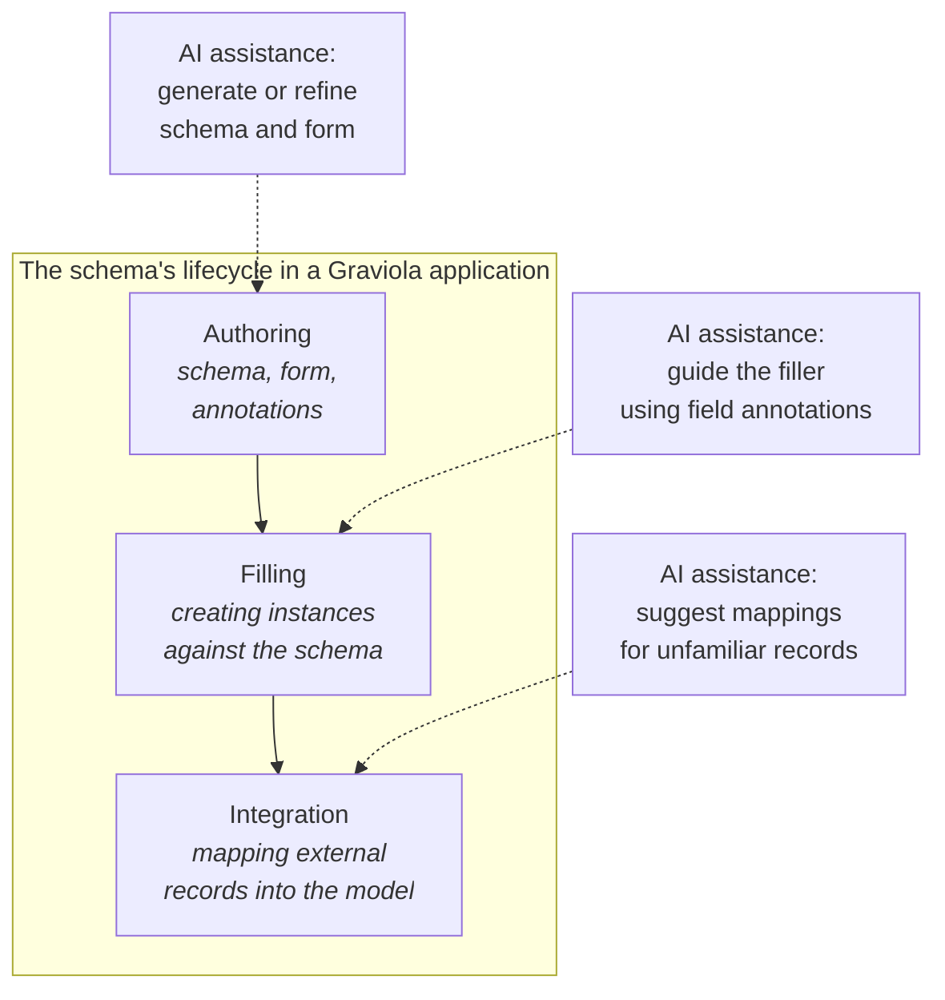

# Graviola in the age of generative tools

This chapter addresses a question readers may bring from the current tooling landscape: whether a schema-driven framework like Graviola remains relevant when generative models can produce working application code from a single prompt.

---

## 1. The question worth asking

A reader could be forgiven for asking why a framework like Graviola should exist at all in a moment when a single prompt can produce a working application. The trajectory of generative coding tools has been steep, and the comfortable assumption that hand-written software is the durable form of an application is being tested in real time. If an LLM can write the form, the validator, the database access, the storage layer, and the UI in one shot, the case for a structured framework is at least worth re-examining.

This chapter takes the question seriously rather than waving it away. It argues, briefly, that the moment generative tools become genuinely capable of producing application code is precisely the moment a framework like Graviola becomes *more* valuable to its users — not less. The argument rests on what kind of artifact is produced, who can revise it, and how AI assistance can be layered onto a structured system in ways that are difficult to layer onto a hand-rolled monolith.

A working starting point for this chapter is the [assisted-forms-designer](https://github.com/gravio-la/assisted-forms-designer), an existing project in the Graviola orbit. It is a WYSIWYG editor for JSON Forms (and Graviola forms) that has recently been extended with an AI assistant. The assistant can produce a full schema and form from a prose description of what the application needs, can take an existing schema and propose a form layout, or can offer incremental suggestions while a domain expert builds a form by hand. The project is small, it is real, and it sketches the shape of a broader pattern.

---

## 2. The economics of generation

When generation is cheap, the question shifts from *can the system produce code* to *what should the produced artifact look like*. Two extremes are worth contrasting.

In one direction, a generative tool produces an entire bespoke application — its own forms, its own validation rules, its own database access, its own UI. The application is a self-contained monolith. Reviewing it requires reading all of it. Modifying it requires understanding how its pieces fit together, none of which has been factored against any external convention. Regenerating part of it risks invalidating the rest. The result is fast to produce and slow to evolve.

In the other direction, a generative tool produces a small set of declarative artifacts — a schema, a form definition, a few annotations, perhaps a custom tester or two — that plug into an existing framework with known semantics. The framework supplies the form rendering, the validation, the persistence, the query engine, the UI components, the storage abstraction. The generated surface is small, its boundaries are clean, and each part can be regenerated independently. Reviewing the generated artifacts is the same task as reviewing hand-written ones. Domain experts who could not read application code can read a JSON Schema, or a form layout, or an annotation set.

The second pattern is what Graviola enables. The framework's architecture — JSON Schema as source of truth, structural dispatch for representation, declarative mappings for integration, the entire structure described in earlier chapters — is precisely the structure that makes generative assistance tractable. The model an LLM is asked to produce is small, well-defined, and reviewable. Most of the application is supplied by the framework, not by the model.

This is a less glamorous claim than the headline that AI will write entire applications. It is also closer to what teams actually need.

---

## 3. Three layers of assistance

A schema in a Graviola application has a lifecycle. It is authored, then it is used to fill in data, and over its lifetime it accumulates relationships with external records that need to be mapped into its terms. AI assistance can attach at each of these stages, doing different work in each, but always against the same schema.

### 3.1 Authoring assistance

This is where assisted-forms-designer already operates. A domain expert — a librarian, a curator, a researcher, a small-NGO administrator — describes what their application needs. The assistant produces a draft schema and form. The expert reviews the draft in a WYSIWYG editor, adjusts what the assistant got wrong, and adds the constraints that only a domain expert can know. The result is a schema and form definition that the framework consumes directly.

The crucial property is that the artifact under review *is* the deliverable. The expert is not reviewing generated code that will then be deployed; they are reviewing a schema that is itself the description of the application. If the assistant misunderstood the domain, the expert sees the misunderstanding in a form they can read, and can correct it in the same WYSIWYG editor. There is no opaque code layer between the description and the running application.

### 3.2 Filling assistance

Once the schema and form exist, the application's users are not the same people who authored it. A field researcher uses the form to enter observations. A volunteer enters event registrations. A cataloger enters bibliographic records. These users are domain-knowledgeable but may not be familiar with every field, every constraint, or every edge case the schema admits.

A second layer of AI assistance attaches here, drawing its instructions from the same annotations the authors placed on form fields. An annotation might say *"describe the substrate's texture as rough, smooth, or granular"*; the assistant uses this to help a researcher whose hands are full convert a verbal description into a structured field value. Another annotation might say *"this field expects the canonical English title; if the source uses a translated title, prefer the original"*; the assistant uses this to flag an inconsistency in what the user entered.

The pattern is that **the schema's annotations become the assistant's instructions**. The application author writes guidance for human users; the same guidance, read by an AI assistant, helps users follow it. No separate authoring effort is required for the AI layer. The annotations exist because human users benefit from them, and the AI assistance is a derivative use of the same content.

### 3.3 Integration assistance

The third layer is the one most familiar to projects that work with linked data. A cataloger encounters a record from an external authority — a Wikidata entry, a GND person, a record from a partner institution — and needs to bring it into the local model. The existing declarative mappings cover the common cases, but the cataloger has found a record that does not quite fit. Some fields are present in unfamiliar shapes; some have no obvious counterpart; some carry information at a different level of granularity than the local schema expects.

An AI assistant placed at this point in the workflow has access to the local schema, the existing mapping configurations, and the unfamiliar record. It can suggest a candidate mapping, flag which fields would be lossy, and propose either a one-off transformation for this record or a new general mapping rule for the project. The cataloger reviews the suggestion in the same way an expert would review a draft from a junior colleague — accepting, refining, or rejecting — and the accepted result becomes part of the project's mappings, available to the next cataloger who encounters a similar record.

This is the kind of integration work that is genuinely tedious for humans, genuinely tractable for AI assistants, and genuinely consequential when it goes wrong. The framework's existing structure makes it possible to assist without taking over: the assistant proposes against an explicit, reviewable schema; the human's role is judgment, not transcription.

---

## 4. Why this configuration works

Three properties of Graviola's existing design make the layered assistance pattern viable, and none of them was added with AI assistance in mind. They are consequences of the framework's structural-dispatch and schema-as-source-of-truth choices.

**Small surface area for generation.** An LLM asked to produce a Graviola application produces a schema, possibly a form definition, possibly some annotations, and possibly a custom tester. It does not produce the form rendering, the validation, the database access, the query engine, or the UI scaffolding. The model's output is small, its shape is well-defined, and its correctness can be checked by reading the artifact rather than by running it.

**Reviewable artifacts.** The artifacts the assistant produces — schemas, form definitions, annotations, mappings — are the same artifacts a domain expert authors by hand. They are not intermediate representations or scaffolds for code that will be generated next. The expert reviews the actual deliverable. When the assistant is wrong, the wrongness is visible at the level the expert can correct.

**Attachment points for guidance.** The same annotations that drive UI rendering, that mark calculated fields, that declare authorization rules, also serve as the natural places to attach guidance for human users — and, by extension, instructions for AI assistants helping those users. The annotation surface is unified; there is no separate "AI configuration" layer.

These properties are independent. A framework could have any one of them without the others. Graviola has all three because they fall out of the same design discipline.

---

## 5. What this future is not

Equally important to the vision is the boundary on what the framework will not become.

This is **not a pivot to AI-first development**. Graviola's primary commitment remains to applications that domain experts can build, evolve, and own without AI assistance. The pattern described here is additive: applications that never use any AI assistance run identically to applications that use it at every stage.

This is **not autonomous agents replacing human authors or users**. At every stage described in section 3, a human reviews and accepts the assistant's output. The assistant proposes; the human decides. The framework's audit trail (the schemas, the mappings, the annotations) reflects the human's decisions, not the assistant's suggestions.

This is **not a claim that AI will replace the framework's structural choices**. Reasoning, dispatching, validating, and querying are still the framework's responsibilities. Generative tools change what is supplied to the framework, not what the framework does with it.

This is **not a roadmap of features**. The assisted-forms-designer is the only piece of this picture currently implemented. The form-filling assistance and integration assistance described in sections 3.2 and 3.3 are directional: they require building, not just enabling. They are sketched here because the framework's existing structure makes them feasible without architectural change, not because they are imminent.

---

## 6. A modest closing claim

The most defensible claim about Graviola in the age of generative tools is the modest one: a framework whose central artifact is a small, reviewable, declarative schema is well-positioned for a world in which schemas can be drafted, refined, and used with AI assistance. The same properties that make the framework approachable for human authors — small artifacts, explicit annotations, structural dispatch — make it approachable for assistants working alongside human authors.

The earlier chapters of this book describe what Graviola is today and where its architecture is heading. This chapter sits beside them rather than in front of them: the future glimpsed here does not require the framework to become something it is not. It requires the framework to remain what it has been — small, structured, schema-driven, oriented toward domain experts — while letting new tools attach themselves to the surfaces that already exist for human use.

The first place to look, for readers wanting to see this in motion, is the [assisted-forms-designer](https://github.com/gravio-la/assisted-forms-designer) repository. It is the smallest concrete instance of the pattern this chapter describes, and it is the foundation on which the rest can be built.

---

## See also

- [Architectural trajectory](trajectory.md) — planned runtime capabilities, distinct from generative authoring patterns.
- [Outlook and open questions](outlook-and-open-questions.md) — unresolved design tensions at the frontier.
- [Glossary](glossary.md) — definitions for terms used across the book.
