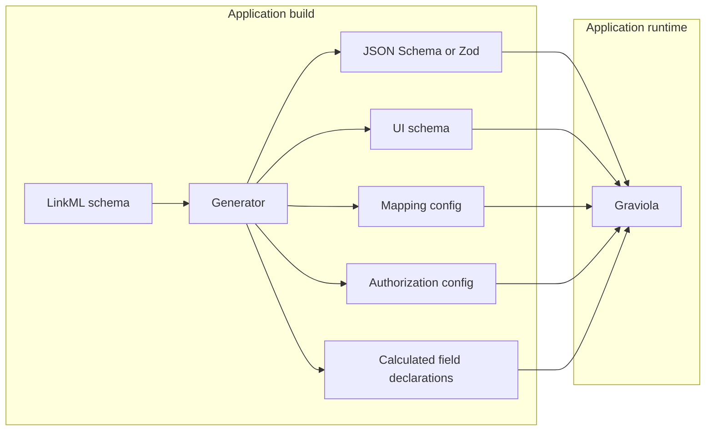

# LinkML as an authoring source for schemas

This chapter describes an **optional authoring path** for teams using Graviola: adopt [LinkML](https://linkml.io/) as a single document they edit, then run a **build-time generator** that emits the same artifacts Graviola already consumes — JSON Schema or Zod, JSON Forms UI schema, mapping and other declarative configuration. **Graviola at runtime is unchanged** and takes no LinkML dependency.

For **what ships today** in the framework, see [Capabilities today](capabilities-today.md). Planned features mentioned below (for example calculated fields) are described under [Architectural trajectory](trajectory.md).

---

## Context

Graviola is built around **JSON Schema** at runtime. The choice is deliberate: JSON Schema is widely understood, well-tooled, and used across many communities outside the semantic-data world. JSON Forms consumes it directly. Validators are abundant. The translation from JSON Schema to SPARQL, to relational queries, and to TypeScript types is well-explored in the framework. Some applications use [Zod 4](https://zod.dev/) instead, deriving JSON Schema from Zod where the framework requires it; the framework supports both shapes.

In practice, however, a Graviola application's model rarely lives in a single file. Around the central JSON Schema (or Zod schema) accumulate complementary declarations for the same conceptual model:

- A **UI schema** giving JSON Forms rendering hints that the schema alone cannot supply.
- **Declarative mappings** for transforming data from external authorities (Wikidata, GND, DBpedia) into the local model.
- Application-specific configuration for **authorization**, **calculated fields**, **default views**, and other cross-cutting concerns.
- Occasional **JSON Schema extensions** (`x-*` keys) for things the standard does not express — for example the inverse of a property.

At runtime these pieces are unified by a shared addressing convention: scopes (JSON Pointer-like paths), mapping-layer selectors, and type IRIs for entity classes. That co-existence is intentional.

What is awkward at **authoring** time is fragmentation: domain experts may edit several files in several formats, each with its own naming and reuse conventions.

One concrete example: an `x-inverseOf` extension can declare that one property is the reverse of another. JSON Schema has no native inverse; the extension lets the query planner and graph-to-JSON extractor know which side is canonical. It works, but it pushes semantic detail into a vocabulary that was not designed for it. Similar pressures appear as the framework grows.

---

## What LinkML offers

[LinkML](https://linkml.io/) is a modeling language (YAML-based, linked-data aware) aimed at describing models richly enough that **many downstream representations** can be generated: JSON Schema, OWL, SHACL, RDF, documentation, and more.

For Graviola-oriented authoring, four properties stand out:

1. **Native constructs** for several things JSON Schema only covers by extension — for example `inverse:`, `equals_expression:`, `identifier: true`, multivalued slots, slot reuse across classes. The inverse-property case can be expressed as first-class LinkML instead of only as `x-inverseOf` in JSON Schema.
2. **Namespaced annotations** on classes, slots, and types — for example `ui.label`, `auth.read`, `calc.complexity`. LinkML carries them; a project-specific generator decides how they map to emitted files.
3. **Compile-first workflow** — author one schema, generate artifacts per consumer. JSON Schema becomes an output, not necessarily the hand-maintained source.
4. **Single-document legibility** — for humans and for tooling (including LLM-assisted authoring), one file can hold structure, relationships, presentation hints, and cross-cutting metadata in one place.

Further reading:

- [LinkML overview](https://linkml.io/linkml/)
- [Schema structure tutorial](https://linkml.io/linkml/intro/tutorial.html)
- [Annotations specification](https://linkml.io/linkml/schemas/annotations.html)
- [Expression language for derived slots](https://linkml.io/linkml/schemas/expression-language.html)

---

## Build-time pattern

The authored source is a LinkML schema. The application author runs a **generator** in the build pipeline. It emits artifacts that would otherwise be maintained by hand: JSON Schema (or Zod), JSON Forms UI schema, mapping configuration, authorization rules, calculated-field declarations (when the application adopts the trajectory described in [Architectural trajectory](trajectory.md)), and any other agreed outputs.



The generator is an **application** concern — CLI, build script, bundler plugin, or small program — not part of Graviola. Generated files can be committed for review or produced in CI; either fits the framework.

Two consequences:

- **No framework change is required** for this path. CRUD, forms, SemanticTable, and mapping keep consuming the same artifact shapes; Graviola does not care whether they were handwritten or generated.
- **Hand authoring remains fully supported.** LinkML is one possible upstream; others are equally valid.

---

## Annotated example

The following LinkML sketch shows classes and slots with annotations in several namespaces. A real project's generator maps each namespace to its target format.

```yaml
id: https://example.org/schemas/library
name: LibrarySchema
description: Persons and works in a small library catalog
prefixes:
  ex: https://example.org/
  linkml: https://w3id.org/linkml/
default_prefix: ex
imports:
  - linkml:types

classes:
  Person:
    description: A natural person
    tree_root: true
    slots:
      - id
      - forename
      - surname
      - fullName
      - authoredWorks
    annotations:
      ui.list_renderer: chip
      ui.detail_layout: two_column
      auth.read: public
      auth.write: "role:editor"

  Work:
    description: A book, article, or other authored work
    tree_root: true
    slots:
      - id
      - title
      - author
      - publicationYear
    annotations:
      ui.list_renderer: card
      auth.read: public
      auth.write: "role:editor"

slots:
  id:
    identifier: true
    range: uriorcurie

  forename:
    range: string
    required: true
    annotations:
      ui.label: "First name"
      ui.detail.priority: 10

  surname:
    range: string
    required: true
    annotations:
      ui.label: "Last name"
      ui.detail.priority: 10

  fullName:
    range: string
    equals_expression: "{forename} + ' ' + {surname}"
    annotations:
      calc.complexity: "O(1)"
      calc.cached: false
      ui.detail.priority: 1
      ui.label: "Full name"

  authoredWorks:
    range: Work
    multivalued: true
    inverse: author
    annotations:
      ui.list.collapsed: true
      ui.label: "Works"

  author:
    range: Person
    required: true
    annotations:
      ui.label: "Author"

  title:
    range: string
    required: true
    annotations:
      ui.detail.priority: 1

  publicationYear:
    range: integer
    annotations:
      ui.label: "Year of publication"
      ui.detail.priority: 5
```

**Emitted JSON Schema (or Zod)** — ranges, identifiers, required and multivalued flags, and class structure carry over in the usual way for your chosen generator.

**Emitted UI schema** — from `ui.*` annotations: labels, layout hints, list renderers, field ordering, collapsed lists.

**Inverse** — `inverse: author` on `authoredWorks` replaces a hand-maintained `x-inverseOf`-style declaration. The generator emits whatever companion shape the project uses for the query planner and graph-to-JSON layer; runtime still does not read LinkML.

**Calculated fields** — `equals_expression` and `calc.*` annotations can feed generated declarations aligned with the direction in [Calculated fields](trajectory.md#calculated-fields).

**Authorization** — `auth.*` maps into the application's own rule format; the vocabulary is project-defined.

---

## Implementation footprint

Adopting this pattern is bounded work for the **application author**:

- A **LinkML reader** — often the official [linkml](https://github.com/linkml/linkml) tooling from a build subprocess, or a TypeScript reader for the subset the project uses.
- A **generator** that walks parsed LinkML and emits the chosen artifact set, ideally as small **per-namespace handlers** (`ui`, `auth`, `calc`, `view`, …) so new concerns add handlers rather than entangling the whole pipeline.
- A **documented registry** of annotation namespaces and meanings for the team.

Graviola packages continue to consume the same outputs as before.

---

## Boundaries

This is a **new authoring path**, not a mandate.

- Per-project or per-schema LinkML adoption is fine; the same monorepo can mix LinkML-backed and hand-authored apps.
- The generator runs at **build time**; Graviola at runtime sees only generated (or handwritten) artifacts.
- The generator should translate only a **documented subset** of LinkML plus agreed annotations. Constructs outside that subset should be ignored or reported, not silently mis-translated.

The generator stays small by design: its contract is what Graviola and the application can act on, not everything LinkML can express.

---

## Summary

Runtime Graviola stays centered on JSON Schema (or Zod-derived JSON Schema) plus companion declaratives, coordinated by scopes, selectors, and type IRIs. Optional LinkML authoring reduces **authoring-surface** fragmentation: one edited document and a build step that produces the same artifact bundle the framework already expects — with no runtime LinkML dependency and no requirement to abandon hand-maintained schemas.

---

## See also

- [What Graviola is](what-graviola-is.md) — runtime role of JSON Schema.
- [Capabilities today](capabilities-today.md) — production surfaces this path feeds.
- [Architecture and data flow](architecture.md) — where schemas sit in the pipeline.
- [Architectural trajectory](trajectory.md) — calculated fields and related directions.
- [Glossary](glossary.md) — shared terms.
